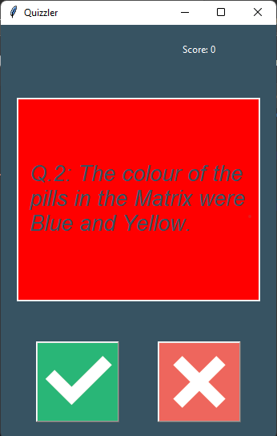
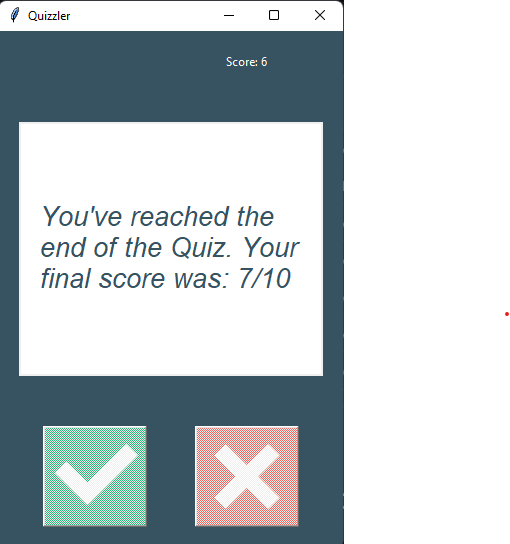

# Quizzler-App-For-PC
Quizzer app created for pc.
Quizzler is python base GUI app which provide random general topic questions base on true/false.

## How to run

1. Download all file from repositery.
2. Install prerequired library and python in system.
3. Run main.py and as showing in image pop up comes.

## instruction for game (basic rules)

  1. As shown in first image screen will apear after run main.py
  2. Click on ✅, if you think answer is "True" for that question
  3. Click on ❌, if you think asswer is "False" for that question
  4. If your selected anwser is right, then display showing green color.(as shown in below screenshot)
  
  
  
  5. If your selected answer is wrong, then display showing red color.(as shown in below screenshow)
  
  
  
  6. After complting 10 questions, showing result display as shown in below sceenshot.
  
  
  
NOTE: 💀💀 You can custumize quiz type by https://opentdb.com/api_config.php create api from this site and add that in data.py file in parameters dictionary.
      for example, https://opentdb.com/api.php?amount=10&category=18&type=boolean, this is api for computer science base test, so for this modify data.py as 
     
 parameters = { 
        'amount':10, 
        'category':18, 
        'type':'boolean' 
      }

      MAKE SURE IT IS SET IN CORRECT WAY, OTHERWISE YOUR APP WILL CRASH. 💀💀
      
      
Thanks & Enjoy 😁😊(❁´◡`❁)

Fill free to reach out me(for suggestion and bugs).
      
